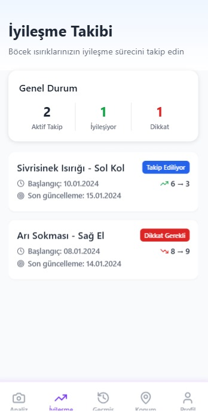
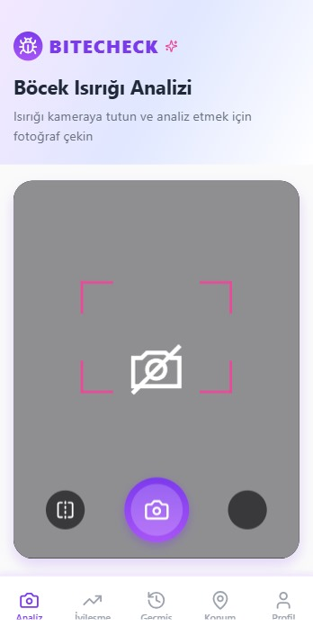
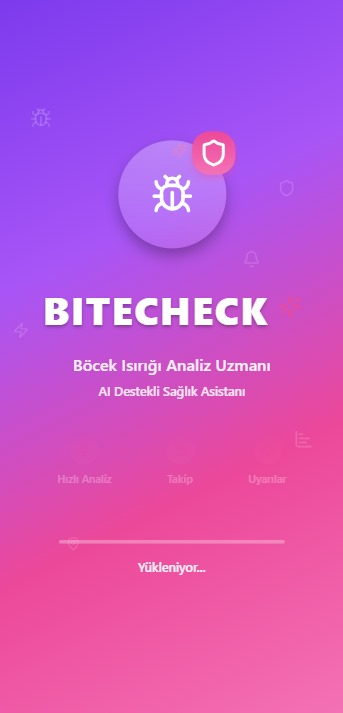
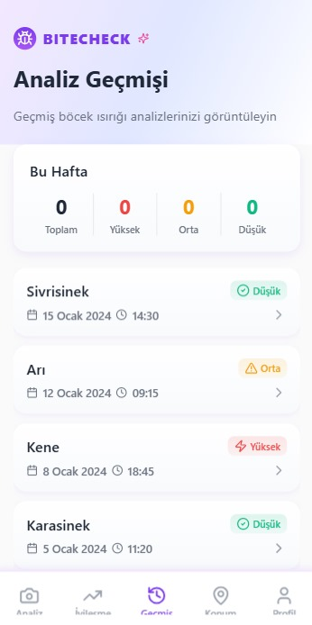
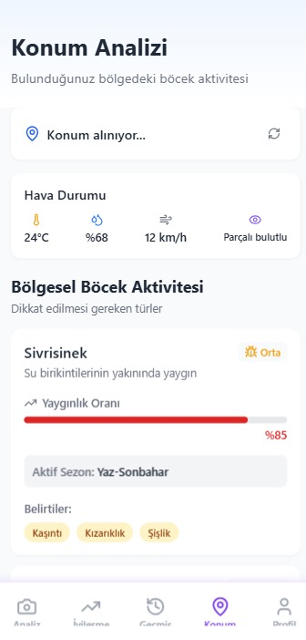
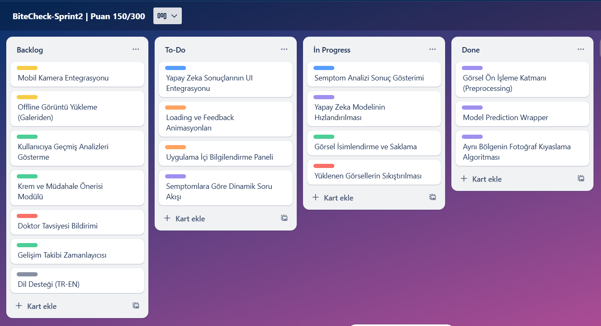

# BiteCheck

## 👥 Ekip Üyeleri (Team Members)

| İsim               | Görev                | Sosyal Medya / LinkedIn             |
|--------------------|----------------------|-------------------------------------|
|Ramazan Bıyık       |Scrum Master          |                                     |
|Merve Çakır         |Product Manager       |                                     |
|Zeynep Şener        |Developer             |                                     |

## 🔗 Product Backlog

👉 [BiteCheck - Trello Backlog](https://trello.com/invite/b/686ac0e915929a628b6cc586/ATTIc8f8464cdf4266f2920acb4ac5679f6a01396288/bitecheck)

## Proje Açıklaması (Product Description)

**BiteCheck**, yapay zekâ destekli bir mobil uygulamadır ve kullanıcıların ciltlerinde beliren kızarıklık, şişlik, kabarıklık gibi problemleri analiz ederek özellikle **böcek ısırıkları ve yaygın cilt sorunlarını** tanımalarına yardımcı olur.

Kullanıcılar sadece bir fotoğraf yükleyerek yapay zekâ tarafından analiz edilen verilerle “ne olabilir?”, “ne sürülmeli?”, “doktor gerekli mi?” gibi sorulara cevap bulabilir. Ayrıca, bölgesel böcek türlerine dayalı olasılık tahmini, gelişim izleme ve arkadaşla paylaşım gibi birçok özellikle sağlık takibini kolaylaştırır.

**BiteCheck**, kullanıcı dostu arayüzü, lokasyon bazlı analizleri ve kişiselleştirilmiş yönlendirmeleriyle, cilt problemlerinde ilk adımı kolayca atmanızı sağlar.

---

## Ürün Özellikleri (Product Features)

### 1. Görsel Tanıma (AI Destekli Analiz)
- Kullanıcı ciltteki sorunun fotoğrafını yükler  
- Yapay zekâ, yüksek olasılıklı tahminler sunar (örn. "%85 sinek ısırığı")  
- Fotoğrafla birlikte alınan semptom bilgileri tanıyı güçlendirir  

### 2. Semptom Sorgulama
- Kullanıcıya sorular yöneltilir:  
  - Kaşıntı var mı?  
  - Lezyon yayılıyor mu?  
  - Ateş veya solunum problemi var mı?  
- Bu verilerle risk seviyesi belirlenir  

### 3. Müdahale Önerisi ve Bilgilendirme
- Cilt problemine özel evde uygulanabilecek çözümler  
- Uygun krem ve hijyen önerileri  
- “Ne zaman doktora gidilmeli?” yönlendirmesi  

### 4. Gelişim Takibi
- Aynı bölgenin gün gün fotoğrafları kaydedilebilir  
- Yapay zekâ bu gelişmeyi analiz eder (İyileşme / kötüleşme)  
- Gelişme durumunda kullanıcıya bildirim gönderilir  

### 5. Lokasyon Bazlı Olasılık Sistemi
- Kullanıcının konumuna göre en olası böcek türü tahmini  
- Örneğin: “İstanbul'da bu hafta çam alerjisi yoğun”  
- Seyahat edenler için bölgesel risk bilgilendirmesi  

### 6. Evcil Hayvan Modülü (Opsiyonel)
- Evcil hayvanların tüy altındaki kızarıklıklarını analiz etme  
- İnsan modülüne benzer şekilde işleyen özel bir panel  

### 7. Ekstra Özellikler
- **Sesli Asistan:** Görme engelliler için sesli açıklamalar  
- **AR Kamera Rehberi:** Fotoğraf çekerken doğru hizalama için kılavuz  
- **Gelişme Bildirimi:** “Kızarıklık büyüdü” uyarısı  
- **Uzman Yönlendirmesi:** Gerekli durumlarda dermatolog önerisi

---

## Hedef Kitle (Target Audience)

### Aileler
- Çocuklardaki böcek ısırıkları, alerjik döküntüler için hızlı kontrol  
- “Doktora gitmeli miyiz?” sorusuna net cevap  

### Kampçılar ve Gezginler
- Doğada sık karşılaşılan ısırıklar ve güneş yanıkları  
- Lokasyona göre en olası riski öğrenme  

### Hijyen ve Sağlık Takipçileri
- Egzama, mantar gibi cilt sorunlarını erken fark etmek  
- Günlük analiz ve müdahale önerileri  

### Evcil Hayvan Sahipleri
- Hayvanlarındaki cilt problemlerini kolayca gözlemleme  
- Veteriner öncesi ilk analiz  

### Yaşlı Bireyler ve Kronik Hastalar
- Şeker hastalığı gibi geç iyileşen yaraların izlenmesi  
- Gelişme takibi ve otomatik uyarılar

#  Sprint 1 - BiteCheck Projesi

##  Sprint Amacı
Bu sprintte amaç, BiteCheck uygulamasının temel fonksiyonlarını oluşturmak; özellikle kullanıcıdan alınan cilt görseli üzerinden yapay zekâ ile ilk tanı tahmininin yapılması ve semptom bilgisinin alınarak tanının desteklenmesidir.

---
## Planlanan Uygulama Tasarımı

--
##  Hedeflenen Başlıca İşler

###  1. AI Görsel Analiz Modülü
- [ ] Fotoğraf yükleme özelliği (kamera ve galeri)
- [ ] Fotoğrafın yapay zekâ modeline gönderilmesi
- [ ] Tahmin sonuçlarının (% olasılıkla) kullanıcıya gösterilmesi

###  2. Semptom Sorgulama Formu
- [ ] “Kaşıntı var mı?”, “Ateş var mı?”, “Yayılıyor mu?” gibi sorular
- [ ] Kullanıcının semptom yanıtlarını arayüzde girebilmesi
- [ ] Bu yanıtların AI tahminiyle birlikte kullanıcıya sunulması

###  3. Gelişim Takibi (Arayüz Taslağı)
- [ ] Günlük fotoğraf yükleme arayüzünün temel tasarımı
- [ ] Tarih bazlı fotoğraf galeri prototipi

---

##  Sprint Board Kullanımı

Sprint görevleri [Trello](https://trello.com) üzerinden yürütülmektedir.

### Kullanılan Sütunlar:
- `To Do` – Yapılacaklar
- `In Progress` – Üzerinde çalışılan görevler
- `Done` – Tamamlanmış görevler

Her kart altında detaylı **checklist** adımları yer almaktadır.

---

## Sprint Sonu Beklenen Çıktılar
- Fotoğraf üzerinden AI tahminini alabilen çalışan temel modül
- Semptom bilgisini alabilen ve sonucu destekleyen sistem
- Ön tasarım olarak gelişim takibi arayüzü

---

## Notlar
- Lokasyon bilgisi bu sprintte dahil edilmemiştir.
- Bu sprint MVP'nin iskeletini oluşturmaya yöneliktir.

#  Sprint 2 - BiteCheck
##  Sprint Notları
- **User Story'ler**, her bir görev kartı içerisinde checklistlerle tanımlanmıştır.
## Sprint Bilgileri
- **Sprint içinde tamamlanması tahmin edilen puan:** 50 Puan
- **Puan tamamlama mantığı:** Proje boyunca tamamlanması gereken toplam 300 puanlık backlog bulunmaktadır. 3 sprinte bölündüğünde ikinci sprintin 50 puandan oluşması gerektiği kararlaştırıldı.
- **Sprint Amacı:** Yapay zeka tahmin ekranlarının UI ile entegre edilmesi, semptom ve görsel analizi modüllerinin fonksiyonel hale getirilmesi

---

## Renk Kodlama Mantığı

| Renk | Açıklama | Kullanım Alanı |
|------|----------|----------------|
| Mavi | UI / Tasarım | Arayüz geliştirme, gösterim |
| Yeşil | Backend / Veritabanı | Veri işleme, saklama, analiz |
| Mor | Yapay Zeka / Modelleme | Görsel işleme, sınıflandırma, model |
| Sarı | Mobil Donanım Özelliği | Kamera, galeri gibi mobil yetenekler |
| Kırmızı | Kritik / Güvenlik | Hata önleme, uyarı sistemleri |
| Turuncu | UX / Animasyon | Kullanıcı deneyimi, animasyonlar |
| Gri | Destek / Dil / Tema | Çoklu dil, temalar, teknik ayarlar |

---

## Daily Scrum
  Daily Scrum toplantılarının Whatsapp üzerinden yapılmasına karar verildi. Günlük Whatsapp konuşmalarımız 

## Ekran Görüntüsü - Sprint Board  
> 

---
## Ürün Güncel Hali

---

## Sprint Review
Sprint sonunda geliştirilen modüller test edildi. Yapay zekadan dönen tahminler başarıyla UI üzerine yansıtıldı. Semptom modülü soruları gösteriyor ve kullanıcı yanıtlarına göre AI modeli çağrılabiliyor. Kamera entegrasyonu tamamlandı ancak galeri yükleme özelliği henüz test aşamasında.

---

## Sprint Retrospective
- **Geliştirilenler:** Tahmin motoru, UI bağlama, semptom ekranı
- **İyileştirme Alanları:** Görsel karşılaştırma algoritması Sprint 3’e bırakıldı.
- **Planlama Kararı:** Story Point tahminleri başarılıydı, benzer yoğunlukta sprint yapısına devam edilecek.

---

